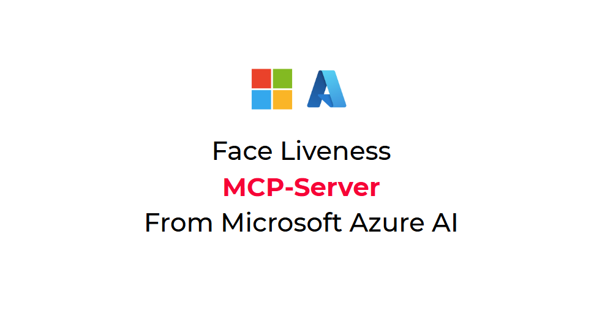

# Azure AI Vision Face MCP-Server

Introducing a Face Liveness MCP Server to allow the embedding of proof of presence during Agentic AI workflows.

[](https://www.youtube.com/watch?v=66sP5z8j_iw)
## Face Liveness Detection
For more information, visit
[Face Liveness Detection](https://learn.microsoft.com/en-us/azure/ai-services/computer-vision/concept-face-liveness-detection)

## Running MCP Server
### add dependency
go to liveness-server-typescript folder, run
```
$ npm install --save-dev typescript @types/node
$ npm install
$ npm run build
```
then in the build folder, you have index.js
### sample for vs code
add .vscode/mcp.json

```
{
    "servers": {
        "liveness-server": {
            "type": "stdio",
            "command": "node",
            "args": [
                "${workspaceFolder}/liveness-server-typescript/build/stdio.js"
            ],
            "env": {
                "FACEAPI_ENDPOINT": "apiendpoint",
                "FACEAPI_KEY": "apikey",
                "FACEAPI_WEBSITE": "https://liveness-webapp.azurewebsites.net",
                "SESSION_IMAGE_DIR": "${workspaceFolder}/liveness-server-typescript/build/"
            }
        }
    }
}

```


### Sample Claude config should be:

```
{
  "mcpServers": {
    "liveness-server": {
      "command": "node",
      "args": ["YOUR_PATH/build/stdio.js"],
      "env": {
                "FACEAPI_ENDPOINT": "apiendpoint",
                "FACEAPI_KEY": "apikey",
                "FACEAPI_WEBSITE": "https://yourexample.azurewebsites.net",
                "SESSION_IMAGE_DIR": "D:\somePATH"
        }
    }
  }
}

```

### Localation of session image
If you don't set the variable for SESSION_IMAGE_DIR, images will not be saved.

### Liveness with verify
When you have a verify image set, it will switch liveness with verify mode.  sample:

```
"VERIFY_IMAGE_FILE_NAME": "${workspaceFolder}/liveness-server-typescript/build/0b5db043-951c-49d4-9109-e11cb558bb79/sessionImage.jpg",

```